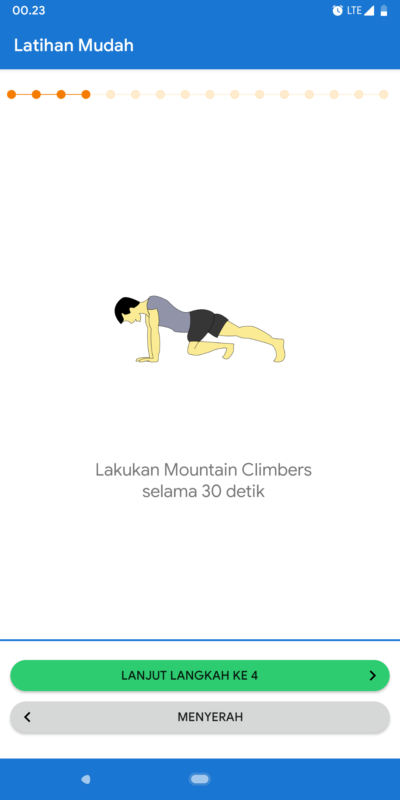

<p align="center">
  
</p>

## Sports Skuyy

This project is our job as students who are assigned to create java-based android applications and are useful for daily life, therefore our team makes Sports Skuyy applications that aim to help our lives to be even more enthusiastic in sports.

### Screenshot

<p align="center">
  
  
  
  
  
  
  
  
  
</p>

### Requirements API 

Devices must use a minimum API 23 (Android Marshmallow) and a maximum using an API 28 (Android Pie).

### Bug

```markdown
You can change the background image for an application into a shape 
because on an Android device that has a screen of less than 5.5 inch 
the application will suffer damage in the background and the worst is 
the application will experience a force close.
```

### Documentation

* [Application Flowchart (PDF)](doc/Sports%20Skuyy%20Logic.pdf)
* [Application Flowchart (Visio)](doc/Sports%20Skuyy%20Logic.vsdx)
* [Report](doc/Report%20Sport%20Skuyy.docx)

### Our Team

* [Moh Ravi Dwi Putra (Team Leader)](https://github.com/rdp77)
* Abdul Rozaq (Sports Research)
* [Dila Alirezeki (Database Programmer)](https://github.com/dilaalrizeki)
* Fabiyan (Programmer)
* Ahmad Rizal (Programmer)
* Ryannov (Designer)
